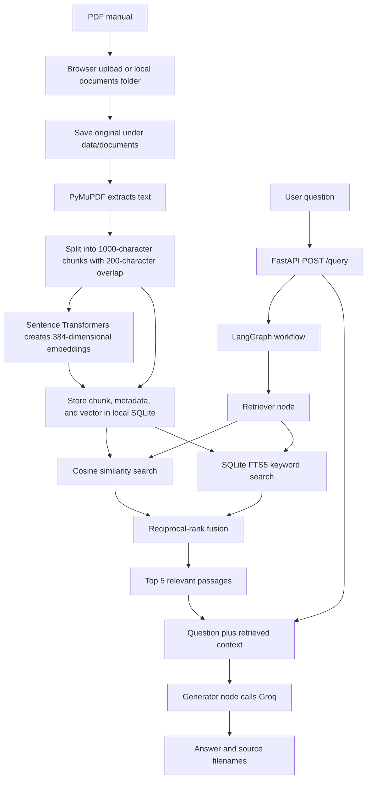

# AeroMind: Aviation Manual RAG

AeroMind is a Retrieval-Augmented Generation (RAG) application for asking questions about aviation manuals. It retrieves relevant passages from uploaded PDF documents and supplies them to a language model as context for an answer.

## The Problem

Aviation manuals are lengthy and use specialized terminology. Finding a precise procedure or definition by searching documents manually takes time. A language model by itself may also answer from general knowledge instead of the specific manual. AeroMind addresses this by retrieving relevant manual passages before generating an answer.

## Workflow



PDFs can enter through the browser's upload control or by placing them in `data/documents/` and running the ingestion script. Both routes extract, chunk, embed, and index the document. The original PDF remains on disk; its searchable chunks, embeddings, and metadata are stored in the local SQLite database at `data/aeromind.sqlite3` by default.

## Technologies Used

- **Python 3.12** for the backend and ingestion pipeline.
- **FastAPI and Uvicorn** for the API, including `POST /documents` and `POST /query`.
- **LangGraph** for the two-step retrieval and generation workflow.
- **LangChain** for model prompts and sentence-transformer embeddings.
- **SQLite with FTS5** for local document storage and keyword search; cosine similarity over stored embeddings provides semantic retrieval.
- **Sentence Transformers (`all-MiniLM-L6-v2`)** for 384-dimensional text embeddings.
- **Groq (`openai/gpt-oss-20b`)** for answer generation.
- **PyMuPDF** for PDF text extraction.
- **Vanilla HTML and JavaScript** for the upload and chat interface.

## LangGraph Nodes

The graph contains two nodes:

- **Retriever:** Calls hybrid search, which retrieves candidates by vector similarity and full-text keyword matching. Reciprocal-rank fusion combines the rankings; the top five passages and their source filenames are passed onward.
- **Generator:** Builds a prompt from the question and retrieved passages, calls the Groq model, and returns the answer. The prompt directs the model to say when the retrieved context is insufficient.

Document upload and ingestion are handled by FastAPI and the ingestion script; they are not LangGraph nodes. The project does not currently have a separate evaluator or reranker node.

## How It Helps

- Searches by meaning as well as exact terms, useful when a question paraphrases manual terminology or names a specific aircraft system.
- Limits the model's input to a small set of relevant passages instead of the entire manual.
- Returns the source filenames so users can identify which manuals informed the response.
- Provides a simple browser upload path that indexes documents immediately.

Retrieval and context grounding can reduce unsupported answers, but they do not guarantee correctness. The current source display includes filenames, not page-level citations.

## Run Locally

Prerequisites: Python 3.12+ and a Groq API key. SQLite is included with Python; no database server or connection URL is required.

1. Create and activate a virtual environment, install dependencies, and copy the environment template:

  ```powershell
  py -3.12 -m venv .venv
  .venv\Scripts\Activate.ps1
  pip install -r requirements.txt
  Copy-Item .env.example .env
  ```

2. Set `GROQ_API_KEY` in `.env`. The local database file is created automatically at `data/aeromind.sqlite3`; set `SQLITE_DB_PATH` only if you want a different location.
3. Start the API in one terminal:

  ```powershell
  uvicorn backend.main:app --reload
  ```

4. Start the frontend in another terminal and open `http://127.0.0.1:8080`:

  ```powershell
  python -m http.server 8080 --directory frontend
  ```

5. Upload a PDF in the Documents panel. Alternatively, place PDFs in `data/documents/` and run `python scripts/ingest_docs.py` to index them from the command line.

The API documentation is available at `http://127.0.0.1:8000/docs`. On first use, AeroMind creates the SQLite tables and FTS5 index. Documents indexed in an earlier PostgreSQL database are not migrated automatically; upload those PDFs again to index them in SQLite.

## Testing

Run the test suite with `python -m pytest`.
